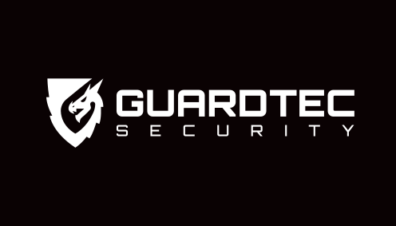

<a name="readme-top"></a>

<div align="center">



<h1>GuardTec Compliance Platform</h1>

<p><strong>Enterprise compliance management for UK licensed security companies</strong></p>

[![Stack][stack-shield]][repo-url]
[![Docker][docker-shield]][repo-url]
[![BS7858][bs-shield]][repo-url]
[![GDPR][gdpr-shield]][repo-url]
[![License][license-shield]][repo-url]

<br/>

[View Demo](#) · [Report Bug](https://github.com/asrarkhantscltd-del/GUARDTEC/issues) · [Request Feature](https://github.com/asrarkhantscltd-del/GUARDTEC/issues)

</div>

---

## Table of Contents

- [About The Project](#about-the-project)
- [Built With](#built-with)
- [Getting Started](#getting-started)
- [Features](#features)
- [Roadmap](#roadmap)
- [Contact](#contact)

---

## About The Project

GuardTec is a full-stack compliance management platform built for UK licensed security companies. It replaces spreadsheets and paper-based vetting with a centralised, role-aware system — covering staff vetting, licence tracking, fleet management, agency operations, and automated compliance alerts.

Designed to meet **BS 7858:2019** screening standards and **UK GDPR** requirements out of the box.

<p align="right">(<a href="#readme-top">back to top</a>)</p>

---

## Built With

| Layer | Technology |
|---|---|
| Frontend | React 18 + TypeScript + Vite + Tailwind CSS |
| Backend | Node.js + Express |
| Database | PostgreSQL 16 |
| Auth | JWT (httpOnly cookies) + CSRF protection |
| Automation | n8n (self-hosted) |
| Containerisation | Docker + Docker Compose |
| Reverse Proxy | Nginx |

<p align="right">(<a href="#readme-top">back to top</a>)</p>

---

## Getting Started

### Prerequisites

- [Docker Desktop](https://www.docker.com/products/docker-desktop/) installed
- A `.env` file with your secrets (see `.env.example`)

### Installation

```bash
# 1. Clone the repo
git clone https://github.com/asrarkhantscltd-del/GUARDTEC.git
cd GUARDTEC

# 2. Set up your environment
cp .env.example .env
# Edit .env with your own values

# 3. Start all services
docker compose up -d
```

App runs at `http://localhost:5173`

<p align="right">(<a href="#readme-top">back to top</a>)</p>

---

## Features

### Staff & Vetting
- BS 7858:2019 onboarding wizard (12-phase screening)
- SIA licence, CSCS, DBS, and Right to Work tracking with expiry alerts
- Document uploads with watermarking and ownership security
- Staff self-service portal

### Compliance
- Real-time compliance status per staff member
- Automated 30/60/90 day expiry warnings
- Pending review workflow for new starters
- Incident reporting with director moderation

### Fleet
- Vehicle register with MOT, insurance, road tax tracking
- Driver assignment and compliance records

### Agency Management
- Multi-agency portal with separate login
- Cover guard deployment and digital acknowledgment system

### Operations
- Event instructions with e-signature acknowledgment forms
- Custom form builder with live preview
- Internal messaging with file/photo/video attachments
- Role-based access: Director, Ops Manager, HR, Agency, Staff

### Automation (n8n)
- Compliance alert emails
- Staff onboarding pipeline notifications
- Payroll preparation reports
- Fleet compliance notifications

<p align="right">(<a href="#readme-top">back to top</a>)</p>

---

## Roadmap

- [x] Staff vetting & BS 7858 wizard
- [x] SIA / CSCS / DBS / RTW compliance tracking
- [x] Fleet management
- [x] Agency portal
- [x] Incident reporting
- [x] Custom forms
- [x] n8n automation agents
- [x] Security audit (rate limiting, XSS, CSRF, secrets management)
- [ ] Cloud deployment (VPS + domain + SSL)
- [ ] JSON → PostgreSQL full migration (Sites, Vehicles, Staff)
- [ ] Mobile-responsive PWA improvements

<p align="right">(<a href="#readme-top">back to top</a>)</p>

---

## Compliance Standards

- **BS 7858:2019** — Security industry staff screening
- **UK GDPR** — Data protection, purpose limitation, and retention
- **SIA Licensing** — Private Security Industry Act 2001
- **Right to Work** — Immigration, Asylum and Nationality Act 2006

---

## Contact

**Asrar Khan** — asrar.khan@guardtec-security.co.uk

Project: [https://github.com/asrarkhantscltd-del/GUARDTEC](https://github.com/asrarkhantscltd-del/GUARDTEC)

<p align="right">(<a href="#readme-top">back to top</a>)</p>

---

<div align="center">
<sub>Built for GuardTec Security Ltd · UK Licensed Security Company</sub>
</div>

<!-- SHIELDS -->
[stack-shield]: https://img.shields.io/badge/Stack-Node.js%20%7C%20React%20%7C%20PostgreSQL-blue?style=flat-square
[docker-shield]: https://img.shields.io/badge/Docker-Compose-2496ED?style=flat-square&logo=docker&logoColor=white
[bs-shield]: https://img.shields.io/badge/Standard-BS%207858%3A2019-red?style=flat-square
[gdpr-shield]: https://img.shields.io/badge/Compliant-UK%20GDPR-green?style=flat-square
[license-shield]: https://img.shields.io/badge/License-Private-lightgrey?style=flat-square
[repo-url]: https://github.com/asrarkhantscltd-del/GUARDTEC
